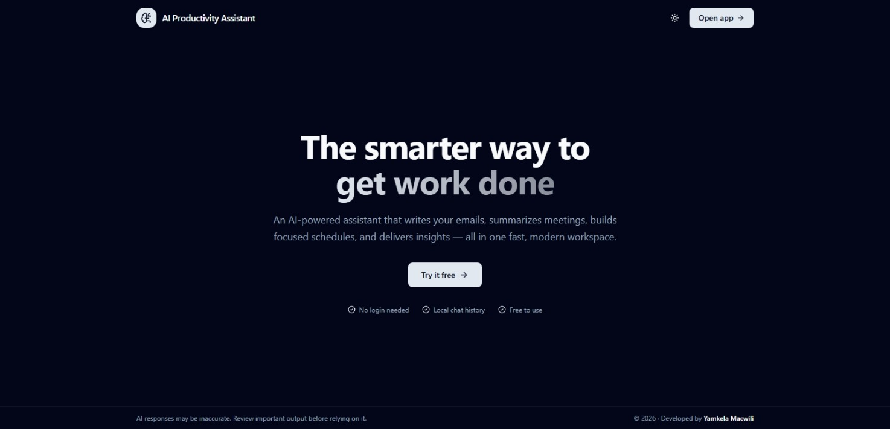
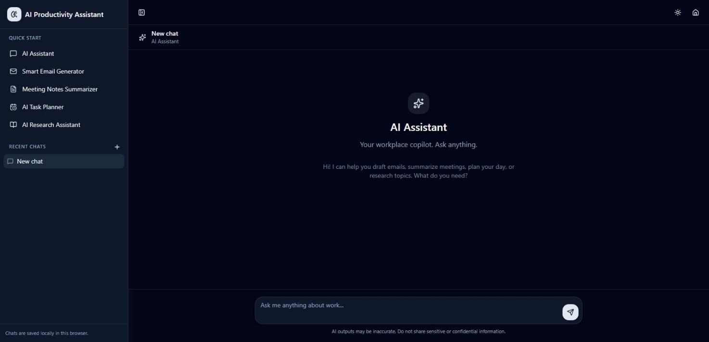

# AI Productivity Assistant

AI Productivity Assistant is a modern, high-performance web application that helps automate workplace tasks using Artificial Intelligence. Built with React 19, TanStack Start, Tailwind CSS v4, and shadcn/ui, the platform delivers a clean, responsive, and professional SaaS-style experience for improving workplace productivity.

---

## Live Demo

[AI Productivity Assistant](https://yamkela-macwili-ai-productivity-assistant.lovable.app)

## Screenshots

### Landing Page



### Application Interface



---

## Project Overview

In today’s digital economy, professionals spend significant time on repetitive workplace tasks such as drafting emails, summarizing meetings, planning schedules, and conducting research. AI Productivity Assistant was developed to solve these challenges by using Artificial Intelligence to automate workflows and improve productivity.

This project demonstrates the practical application of AI in a workplace environment through intelligent task automation, prompt engineering, and real-time AI interaction. The application is designed to provide a modern, responsive, and efficient assistant experience that improves decision-making, saves time, and enhances workplace efficiency.

---

## Project Objectives

This solution was designed to:

- Automate repetitive workplace tasks using AI
- Improve productivity and workflow efficiency
- Demonstrate practical AI integration in a real-world application
- Apply prompt engineering techniques for accurate AI responses
- Provide an interactive workplace assistant experience
- Showcase responsible and ethical AI usage

---

## Problem Statement

Professionals across industries spend significant time handling repetitive tasks such as writing emails, summarizing information, organizing schedules, and conducting research. These tasks can reduce efficiency and productivity when performed manually.

AI Productivity Assistant addresses this challenge by providing an AI-powered workplace assistant capable of simplifying and automating common professional workflows through intelligent AI-generated responses and task management features.

---

## Features

| Feature | Description |
|----------|-------------|
| Smart Email Generator | Generate professional emails based on context, tone, and audience |
| Meeting Notes Summarizer | Convert lengthy meeting notes into concise summaries with action items |
| AI Task Planner | Create structured schedules and prioritize tasks effectively |
| AI Research Assistant | Summarize articles and topics with insights and recommendations |
| General AI Chat | Interactive AI workplace assistant for productivity support |

---

## Core Functional Requirements Implemented

### 1. Smart Email Generator

- Generates context-based professional emails
- Supports multiple tones including formal, informal, and persuasive
- Adapts messaging based on audience type

### 2. Meeting Notes Summarizer

- Converts lengthy notes into concise summaries
- Extracts key decisions and action items
- Highlights responsibilities and deadlines

### 3. AI Task Planner / Scheduler

- Generates structured daily and weekly plans
- Prioritizes tasks using productivity frameworks
- Suggests time optimization strategies

### 4. AI Research Assistant

- Summarizes articles, reports, and topics
- Provides key insights and recommendations
- Simplifies complex information using ELI5 explanations

### 5. AI Chatbot Interface

- Provides an interactive AI assistant experience
- Supports multiple prompts and responses
- Simulates a real workplace productivity assistant

---

## Tech Stack

- Framework: [TanStack Start](https://tanstack.com/start)
- Frontend: React 19 + Vite 7
- Styling: Tailwind CSS v4
- Components: shadcn/ui
- AI SDK: AI SDK v4 with Lovable AI Gateway
- State Management: TanStack Query
- Storage: localStorage
- Markdown Support: react-markdown

---

## Project Structure

```bash
src/
  routes/
    __root.tsx
    index.tsx
    chat.index.tsx
    chat.$threadId.tsx
    api/chat.ts

  components/
    app-sidebar.tsx
    chat-layout.tsx
    chat-window.tsx
    ui/

  lib/
    prompts.ts
    threads.ts
    ai-gateway.server.ts

  integrations/
    supabase/
```

---

## Getting Started

### Prerequisites

- Bun or Node.js 20+
- Lovable AI Gateway API key

### Install Dependencies

```bash
bun install
```

### Environment Variables

Create a `.env.local` file:

```bash
LOVABLE_API_KEY=your_lovable_ai_gateway_key
```

### Run Development Server

```bash
bun run dev
```

Open:

```bash
http://localhost:3000
```

### Build for Production

```bash
bun run build
```

---

## How It Works

1. Users access the landing page and choose an AI productivity tool
2. The chat interface creates or opens an AI conversation thread
3. Messages are streamed to the AI API route in real time
4. AI responses are generated using mode-specific prompts
5. Conversations are stored locally using localStorage

---

## AI Modes

- `general` : General workplace assistant
- `email` : Professional email generation
- `notes` : Meeting notes summarization
- `planner` : Task planning and scheduling
- `research` : Research summaries and insights

---

## Responsible AI Practices

This project applies responsible AI principles by:

- Keeping conversations local-first using localStorage
- Avoiding unnecessary personal data collection
- Using AI-generated responses as assistance rather than guaranteed factual output
- Encouraging users to review AI-generated workplace content
- Providing transparent AI-powered functionality

---

## Authentication

This application is intentionally auth-free. No login or account is required. All conversations are stored locally in the browser.

Future authentication support can be added using the included Supabase integration.

---

## Customization

- Edit `src/styles.css` to customize design tokens
- Edit `src/lib/prompts.ts` to modify AI system prompts
- Edit `src/routes/api/chat.ts` to change the AI model
- Edit `src/routes/index.tsx` to update landing page content

---

## Deployment

This project can be deployed using:

- Vercel
- Netlify
- Lovable
- Any Node.js-compatible hosting provider

---

## License

MIT License

Copyright (c) 2026 Yamkela Macwili

Permission is hereby granted, free of charge, to any person obtaining a copy of this software and associated documentation files to deal in the Software without restriction, including without limitation the rights to use, copy, modify, merge, publish, distribute, sublicense, and/or sell copies of the Software.

THE SOFTWARE IS PROVIDED "AS IS", WITHOUT WARRANTY OF ANY KIND.
